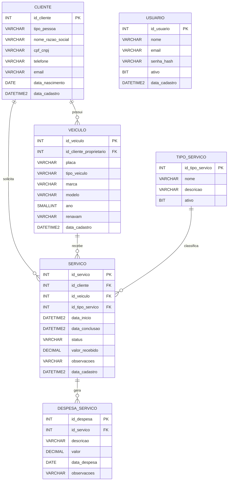

# DespachanteControl

Sistema web desenvolvido como projeto de portfólio e extensão acadêmica para auxiliar um microempreendimento de despachante documentalista no controle de clientes, veículos, serviços e resultados financeiros.

## Problema

O controle atual é realizado principalmente em papel e arquivos físicos, dificultando o acompanhamento de:

- clientes;
- veículos;
- serviços em andamento;
- serviços concluídos;
- despesas;
- valores recebidos;
- resultado financeiro.

## Objetivo

Centralizar essas informações em uma aplicação web simples, permitindo acompanhar melhor a operação e o resultado financeiro do negócio.

## Stack

- SQL Server
- SQL Server Management Studio
- Node.js + TypeScript
- React + TypeScript

## Banco de Dados

A modelagem foi desenvolvida manualmente com foco em SQL Server, integridade dos dados e consultas analíticas.

### Entidades principais

- `Cliente`
- `Usuario`
- `Veiculo`
- `TipoServico`
- `Servico`
- `DespesaServico`

### Relacionamentos

- Cliente 1:N Veiculo
- Cliente 1:N Servico
- Veiculo 1:N Servico
- TipoServico 1:N Servico
- Servico 1:N DespesaServico

A entidade `Usuario` é utilizada para autenticação administrativa e, no MVP, não possui relacionamento direto com as demais entidades de negócio.

## Regras de Negócio

- O cliente pode ser pessoa física ou jurídica.
- O cliente que solicita o serviço não precisa ser o proprietário do veículo.
- Um serviço pode possuir várias despesas.
- Um serviço também pode existir sem despesas.
- O custo total não é armazenado diretamente.
- O resultado líquido não é armazenado diretamente.
- Serviços podem possuir os status `EM_ANDAMENTO`, `CONCLUIDO` ou `CANCELADO`.
- Um serviço cancelado pode possuir valor recebido caso tenha ocorrido alguma cobrança.
- CPF/CNPJ, placa e RENAVAM não podem ser duplicados.
- A data de conclusão não pode ser anterior à data de início.
- Valores recebidos não podem ser negativos.
- Despesas devem possuir valor maior que zero.
- O acesso à aplicação será restrito a usuários administrativos autenticados.
- As senhas não serão armazenadas em texto puro; o banco armazenará apenas o hash da senha.
- Usuários podem ser desativados sem necessidade de exclusão do registro.

### Cálculos

```text
Custo total = soma das despesas do serviço

Resultado líquido = valor recebido - custo total
```

## DER



## Integridade dos Dados

O banco utiliza diferentes mecanismos para garantir consistência e integridade:

- `PRIMARY KEY`
- `FOREIGN KEY`
- `IDENTITY`
- `NOT NULL`
- `UNIQUE`
- `CHECK`
- `DEFAULT`

Exemplos implementados:

- `cpf_cnpj` é único;
- `placa` é única;
- `renavam` é único;
- `email` de usuário é único;
- `tipo_pessoa` aceita apenas `PF` ou `PJ`;
- `status` aceita apenas valores definidos;
- `valor_recebido` não pode ser negativo;
- `valor` de uma despesa deve ser maior que zero;
- `data_conclusao` não pode ser anterior a `data_inicio`.

## Autenticação

O sistema será acessado apenas por usuários administrativos autenticados.

A autenticação será implementada no backend utilizando a tabela `Usuario`.

Fluxo previsto:

```text
React
  ↓
Login
  ↓
API Node.js + TypeScript
  ↓
Validação do usuário
  ↓
SQL Server
```

A senha informada pelo usuário não será armazenada diretamente.

O backend será responsável por:

- gerar o hash da senha;
- comparar a senha informada com o hash armazenado;
- validar se o usuário está ativo;
- controlar sessão ou token de autenticação;
- proteger os endpoints da API.

## Views

### `vw_ResumoFinanceiroServico`

Consolida informações operacionais e financeiras de cada serviço, incluindo:

- cliente;
- placa;
- tipo de serviço;
- status;
- data de início;
- data de conclusão;
- valor recebido;
- custo total;
- resultado líquido.

O custo total e o resultado líquido são calculados a partir das despesas registradas, evitando redundância no banco.

### `vw_DashboardResumo`

Retorna os principais indicadores utilizados no dashboard:

- receita total;
- custos totais;
- resultado líquido;
- quantidade de serviços;
- serviços em andamento.

## Stored Procedure

### `sp_ResumoFinanceiroServico`

Stored Procedure criada para retornar o resumo financeiro de um serviço específico a partir do seu identificador.

Exemplo:

```sql
EXEC sp_ResumoFinanceiroServico @id_servico = 1;
```

## Índices

Foram criados índices com base nos principais padrões de consulta da aplicação:

- `IX_Servico_Status`
- `IX_Servico_DataInicio`
- `IX_DespesaServico_IdServico`

Os índices foram definidos para melhorar consultas relacionadas a:

- serviços por status;
- serviços por período;
- relacionamento entre serviços e despesas.

## Consultas Analíticas

O projeto possui consultas SQL voltadas para análise operacional e financeira, incluindo:

- receita por mês;
- serviços mais realizados;
- quantidade de serviços por status;
- resumo financeiro por serviço;
- indicadores gerais do dashboard.

Entre os principais recursos utilizados nas consultas estão:

- `INNER JOIN`
- `LEFT JOIN`
- `GROUP BY`
- `SUM`
- `COUNT`
- `COALESCE`
- `YEAR`
- `MONTH`
- `ORDER BY`

## Estrutura dos Scripts SQL

```text
database/
├── 01_create_database.sql
├── 02_create_tables.sql
├── 03_seed_data.sql
├── 04_views.sql
├── 05_indexes.sql
├── 06_procedures.sql
└── 07_analytical_queries.sql
```

Os scripts foram organizados por responsabilidade para facilitar manutenção, versionamento e reprodução da estrutura do banco de dados.

## Decisões Técnicas

Algumas decisões importantes tomadas durante o desenvolvimento:

- cliente PF e PJ foram mantidos em uma única entidade;
- o cliente solicitante do serviço pode ser diferente do proprietário do veículo;
- despesas foram separadas em uma entidade própria para permitir múltiplos custos por serviço;
- custo total e resultado líquido não são armazenados, pois são atributos derivados;
- foi utilizado `DECIMAL` para valores financeiros;
- `LEFT JOIN` foi utilizado nas despesas para permitir serviços sem custos registrados;
- `COALESCE` foi utilizado para transformar valores nulos em zero em cálculos financeiros;
- índices foram criados apenas onde havia justificativa pelos padrões de consulta;
- autenticação foi separada da lógica de negócio;
- a senha será armazenada apenas na forma de hash;
- o backend será responsável por autenticar usuários e proteger os dados da aplicação.

## Status do Projeto

### Banco de Dados

- ✅ Modelagem conceitual
- ✅ Modelagem lógica
- ✅ Tabelas
- ✅ Relacionamentos
- ✅ Regras de integridade
- ✅ Dados iniciais
- ✅ Views
- ✅ Consultas analíticas
- ✅ Índices
- ✅ Stored Procedure
- ✅ Entidade de usuário
- ✅ DER
- ✅ Documentação SQL

### Aplicação

- ⏳ Autenticação
- ⏳ Backend/API
- ⏳ Frontend
- ⏳ Integração com SQL Server
- ⏳ Dashboard visual
- ⏳ Testes funcionais

## Próximas Etapas

- criação da interface da aplicação;
- desenvolvimento da API Node.js + TypeScript;
- implementação da autenticação;
- integração da API com SQL Server;
- integração do frontend com a API;
- implementação do dashboard visual;
- testes funcionais;
- refinamento da documentação;
- publicação da aplicação com acesso restrito.

## Objetivo de Portfólio

Este projeto foi estruturado para demonstrar principalmente conhecimentos em:

- SQL Server;
- modelagem de dados;
- relacionamentos;
- integridade referencial;
- consultas SQL;
- análise de dados;
- Views;
- Stored Procedures;
- índices;
- construção de indicadores;
- integração entre banco de dados e aplicação.

A implementação da aplicação será utilizada para consumir e apresentar os dados estruturados no banco, mantendo a camada de dados como uma das principais partes técnicas do projeto.
